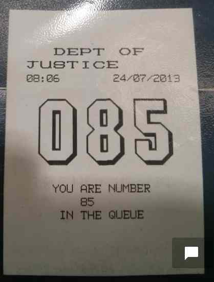

# Introduction
This project represents back-end implementation of social queueing application. It's one of the projects implemented inhttp://www.codeforireland.com/

The purpose of the application is estimate how long client has to wait until he/she will be serviced based on his ticket number and currently serviced number. Both information are provided by users.

# Version 1
## Implementation
Code is implemented using Java with Spring Framework (web serviced and persistence), mysql database.

# Version 3

The only difference between version 3 and 2 is the algorithm which is used to calculate the service time, all the remaining elements of the application like API, Deployment, Server configuration, Framework and language remains this same.

## Algorithm
Approach used in this version is working on different basis in comparison with previous version.

The main difference is that v2 was estimating quality of the input at the time user passed the data to the system - in this version this happens just before making the calculation and quality of the data might change between the calls.

The decision about the shape of new algorithm was based on thorough analysis of historical data.

The steps of the algorithm:

1. User enters information what is his ticket number and what is currently serviced ticket number
2. Input data is filtered and split on 2 categories: valid and invalid, only valid data is used in further steps, there are 2 filters which are responsible for validation of input data:
  - duplicate filter - this filter marks the data as invalid if user with this same ticket number entered 2 or more entries with this same served number (for example: entry1: user ticket=2, served ticket=3, entry2: user ticket=3, served ticket=4, entry3: user ticket=2, served ticket=3 then entry3 will be marked as invalid/duplicate)
  - not in range filter - this filter marks the data as invalid if the increase of the served ticket number does not follow the 3. increase in the time (for example entry1: served ticket=3, time = 3min, entry2: served ticket=4, time=4min, entry3: served ticket5, time=10min, the the average time per ticket is 1min, so the entry3 is not valid as it's way above the average) 
4. all valid data are used to calculate regression line representing the relation between served ticket and time
5. the time when user will be served is calculated based on the regression calculation from the previous step

TODO:
1) Test new endpoints:
- @RequestMapping(value = "v2/queues/{queueId}/tickets/{ticketId}", method = RequestMethod.POST)
- @RequestMapping(value = "v2/queues/{queueId}/tickets/{ticketId}", method = RequestMethod.GET)

2) Update documentation to represent current implementation of estimator

Full documentation:
http://projects.appbucket.eu/myq.html
