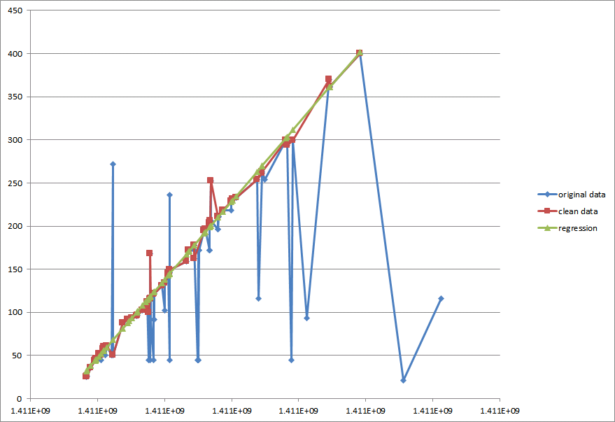
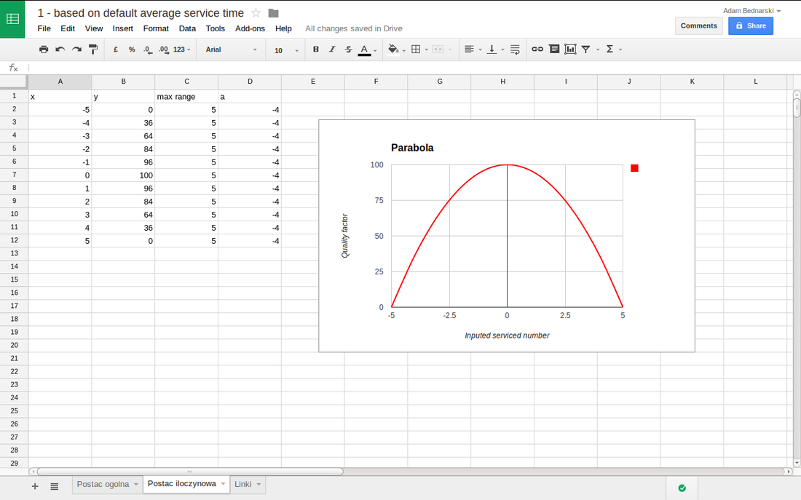

# Introduction
This project represents back-end implementation of social queueing application. It's one of the projects implemented inhttp://www.codeforireland.com/

The purpose of the application is estimate how long client has to wait until he/she will be serviced based on his ticket number and currently serviced number. Both information are provided by users.


## Implementation
Code is implemented using Java with Spring Framework (web serviced and persistence), mysql database.

# Version 3

The only difference between version 3 and 2 is the algorithm which is used to calculate the service time, all the remaining elements of the application like API, Deployment, Server configuration, Framework and language remains this same.

## Algorithm
Approach used in this version is working on different basis in comparison with previous version.

The main difference is that v2 was estimating quality of the input at the time user passed the data to the system - in this version this happens just before making the calculation and quality of the data might change between the calls.

The decision about the shape of new algorithm was based on thorough analysis of historical data.

The steps of the algorithm:

1. User enters information what is his ticket number and what is currently serviced ticket number
2. Input data is filtered and split on 2 categories: valid and invalid, only valid data is used in further steps, there are 2 filters which are responsible for validation of input data:
  - duplicate filter - this filter marks the data as invalid if user with this same ticket number entered 2 or more entries with this same served number (for example: entry1: user ticket=2, served ticket=3, entry2: user ticket=3, served ticket=4, entry3: user ticket=2, served ticket=3 then entry3 will be marked as invalid/duplicate)
  - not in range filter - this filter marks the data as invalid if the increase of the served ticket number does not follow the 3. increase in the time (for example entry1: served ticket=3, time = 3min, entry2: served ticket=4, time=4min, entry3: served ticket5, time=10min, the the average time per ticket is 1min, so the entry3 is not valid as it's way above the average) 
4. all valid data are used to calculate regression line representing the relation between served ticket and time
5. the time when user will be served is calculated based on the regression calculation from the previous step

## Example of historical data

The graph bellow represents one day historical data and the results of the applying algorithm described above.
(x axis represents currently served ticket number and y axis the time when data were entered to the system)
​

The data marked BLUE are original data entered by the users without any filtering.
The data marked RED are the subset of the original data which were marked as valid using filters described in the algorithm.
​The data marked as GREEN is the result of calculating regression line between the points of valid data.



## Technical notes

Calculation of the regression line was done using apache math library.

# Version 2

## Algorithm

The users can request for the information (office details, time to be serviced etc.) or send information to the system (currently serviced number, his/her ticket number)

Each time user provide currently serviced number it's input is validated against the closeness to the expected by the system serviced number. So each entry is saved with the input quality factor (value between 0 and 100 - where 100 means top quality information).



If the input quality is acceptable (high enough) the average waiting time per customer is recalculated.

When user requests information when he/she will be served system already know who is being currently served based on his/other users inputs, also system knows what is user number and what is the average waiting time per user - based on these information it's possible to estimated with certain level of probability what is current waiting time for user.

## Deployment

Application is build using maven:

> maven install

the result is war file in targer folder which needs to be deployed in the web server.

## Configuration of web server

1. Set timezone to UTC:

  - in linux (or windows cygwin) for tomcat 7 - go to bin folder and create file setenv.sh with content: CATALINA_OPTS=-Duser.timezone=UTC

  - for windows: TODO

Note: All dates and calculations in the application are based on UTC and not local time. It is responsibility of the client to convert dates to local time zone.

2. Set DB credentials:

  - in linux (or windows cygwin) for tomcat 7 - go to conf folder and add at the end of catalina.properties content:
```
JDBC_DRIVERCLASSNAME=com.mysql.jdbc.Driver
JDBC_URL=jdbc:mysql://<DB_URL>:3306/ebdb
JDBC_USERNAME=<USER>
JDBC_PASSWORD=<PASSWORD>
```

Above example of the URL works fine for AWS hosted DB, might be different for other providers

  - in windows: TODO

## API
The communication with the backend is provided using JSON format. List of the API supported by the application - examples presented using CURL application

  - get list of queues:
  ```
  curl -i -H \
          "Content-Type: application/json" \
          -X GET \
          http://localhost:8080/Qman/queues
  ```

  - get queue details
  ```
  curl -i -H \
          "Content-Type: application/json" \
          -X GET \
          http://localhost:8080/Qman/queues/3/details
  ```

  - get queue details (depracated)
  ```
  curl -i -H \
          "Content-Type: application/json" \
          -X GET \
          http://localhost:8080/Qman/queues/3
  ```
  
  - get queue stats
  ```
  curl -i -H \
          "Content-Type: application/json" \
          -X GET \
          http://localhost:8080/Qman/queues/3/stats
  ```

  - get client status
  ```
    curl -i -H \
          "Content-Type: application/json" \
          -X GET \
          http://localhost:8080/Qman/queues/3/tickets/2
  ```

  - post client update
  ```
  curl -i -H \
          "Content-Type: application/json" \
          -X POST -d '{"servicedTicketNumber":"117"}' \
          http://localhost:8080/Qman/queues/3/tickets/1
  ```

  - configuration
  ```
  // flush all the caches in the application
  curl -i -H \
          "Content-Type: application/json" \
          -X GET \
          http://localhost:8080/Qman/resetCaches
  ```

  - post feedback
  ```
  curl -i -H \
          "Content-Type: application/json" \
          -X POST -d '{"rating":"1"}' \
          http://localhost:8080/Qman/feedbacks
  ```      

## DB structure
TODO

## Adding new queue
There are 2 parts which needs to be accomplished to add new queue:

1. db configuration
  
  DB tables needs to be populated with queue specific information:

  queues: (list of queues) - id - unique queue id (+1 form the last one) - name - short name for the queue/office

queues_details: (details related to the queue/office) - description - description of the queue (what issues can be sorted out in certain office/service etc.), used for showing queue details - latitude/longitude - geographical location of the office, used for showing map - email - address for containing with certain office, shown in queue details - address_line_1 / 2 - physical address of the office, shown in queue details - town_city - self descriptive, shown in queue details - county - self descriptive, shown in queue details - post code - self descriptive, shown in queue details - default_average_waiting_time - how long by default client needs to wait to be serviced, in milliseconds - website - self descriptive, shown in queue details - name - full name of the queue/office

queues_opening_hours: (opening hours on each day of the week) - queue_id - self descriptive - day_id - day number, where 1 is Monday and 7 is Sunday - opening_hour_local_timezone - opening hour in local time zone - opening_minute_local_timezone - same as above but for minute - closing_hour_local_timezone - self descriptive - closing_minute_local_timezone - self descriptive - opening_hour_utc - same as opening_hour_local_timezone but in UTC - opening_minute_utc - self descriptive - closing_hour_utc - self descriptive - closing_minute_utc - self descriptive

queues_phone_numbers: (phone number to the office) - queue_id - self descriptive - country_code - international country code (without 0x prefix), for example 48 for Poland and 353 for Republic of Ireland - area_code - area code (without 0x prefix), for example 22 for Warsaw area in Poland and 1 for Dublin area in Republic of Ireland - line_number - local phone number - extension - extension of the local phone number (not obligatory)

2. static files configuration (images)

The files needs to be store on the server which hosts UI or in the mobile application and not on the backend server.

Example of script allowing for converting high resolution image to the required formats using image-magic tool:

>  identify source.jpg

> source.jpg JPEG 640x232+0+0 DirectClass 8-bit 124.7K 0.000u 0:01

> cp source.jpg 3_xs@2x.jpg

> gm convert -size 1396x506 source.jpg     -resize 1396x506 -background black     -compose Copy -gravity center     -extent 1396x506     -quality 30 3_lg@2x.jpg

> gm convert -size 1024x371 source.jpg     -resize 1024x371 -background black     -compose Copy -gravity center     -extent 1024x371     -quality 30 3_md@2x.jpg

> gm convert -size 800x290 source.jpg     -resize 800x290 -background black     -compose Copy -gravity center     -extent 800x290     -quality 30 3_sm@2x.jpg

> gm convert -size 400x145 source.jpg     -resize 400x145 -background black     -compose Copy -gravity center     -extent 400x145     -quality 30 3_sm.jpg

In above example source.jpg is base image in resolution 640x232, the convertsion is done for the queue number 3, the file names are build as following the pattern: - 3_lg@2x.jpg - queue 3, resolution 1396x506 - 3_sm.jpg - queue 3, resolution 400x145 etc.

## TODO:
1. Test new endpoints:
  - @RequestMapping(value = "v2/queues/{queueId}/tickets/{ticketId}", method = RequestMethod.POST)
  - @RequestMapping(value = "v2/queues/{queueId}/tickets/{ticketId}", method = RequestMethod.GET)

2. Update documentation to represent current implementation of estimator
